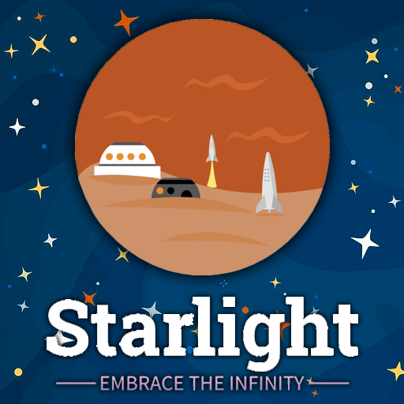

<!-- PROJECT LOGO -->
 

  

<h3 align="center">Starlight Space Journeys</h3>

  

    Starlight Space Journeys was a website project that originated from a school assignment. 
    The assignment's goal was to create a fully responsive website 
    tailored for a client requesting a space themed eCommerce store. In addition, the project showcases a 
    series of cleverly integrated JavaScript scripts, enabling captivating features such as 
    interactive button events and dynamic testimonial slideshows, among others.
     
    <a href="https://github.com/Tipzilla/Starlight-Space-Journeys"><strong>Explore the docs »</strong></a>
     
     
    <a href="https://github.com/Tipzilla/Starlight-Space-Journeys/issues">Report Bug</a>
    <a href="https://github.com/Tipzilla/Starlight-Space-Journeys/issues">Request Feature</a>
  

<!-- TABLE OF CONTENTS -->

  
Table of Contents

  <ol>
    <li><a href="#about-the-project">About The Project</a></li>
    <li><a href="#contact">Contact</a></li>
  </ol>

<!-- ABOUT THE PROJECT -->
## About The Project

<ul>
                        <li>Responsive Design: The website is fully responsive, ensuring an optimal viewing experience across various devices and screen sizes.</li>
                        <li>CSS Techniques: The project leverages advanced CSS techniques to create an aesthetically pleasing and well-structured webpage.</li>
                        <li>JavaScript Functionality: Several JavaScript scripts have been implemented to enhance user interactivity and functionality. </li>
                        <li>Imaginative Design: The website showcases a creative and imaginative design, aligning with the space theme and capturing the user's attention.</li>
                        <li>User-Friendly Navigation: The website is designed with user-friendly navigation, making it easy for visitors to explore and interact with the content.</li>
                        <li>Skill Demonstration: The project serves as a platform for showcasing the application of web development skills, including coding, design, and user experience considerations.</li>
</ul>

(<a href="#readme-top">back to top</a>)

<!-- CONTACT -->
## Contact

Hamish Getty - [LinkedIn](https://www.linkedin.com/in/hamish-getty-596894269/)

Project Link: [https://github.com/Tipzilla/Starlight-Space-Journeys](https://github.com/Tipzilla/Starlight-Space-Journeys)

(<a href="#readme-top">back to top</a>)

